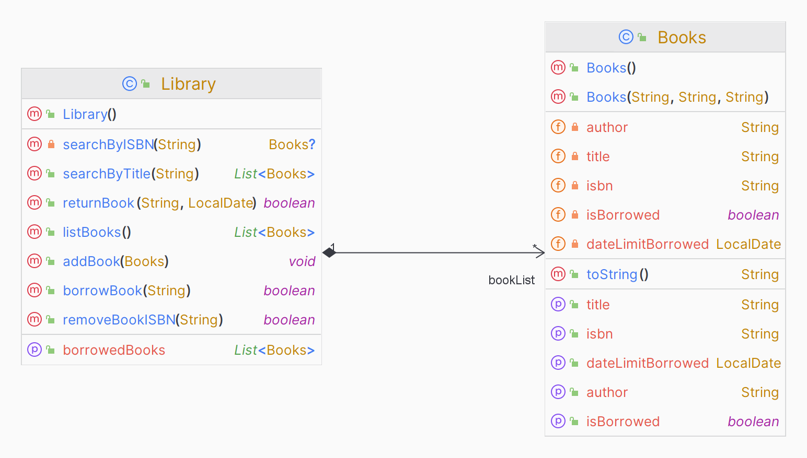

# Sistema Simples de Gerenciamento de Biblioteca

## Funcionalidades

- Adicionar, atualizar e excluir livros.
- Registrar transações de livros (check-in e check-out).
- Listar livros (Todos e Emprestados)
- Buscar por titulo

## Diagrama de Classes

